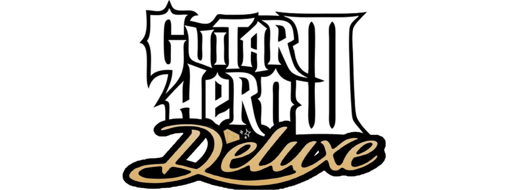

## *Guitar Hero III Deluxe* is a Quality-of-Life Mod for all platforms.

### 👉 See [Full Feature List](https://github.com/nsneverhax/guitar-hero-3-deluxe/blob/main/dependencies/features.md#features)

### 📥 [Download Now!](#%EF%B8%8F-what-youll-need)

# ✍️ What You'll Need

### Playing *Guitar Hero III Deluxe* requires these things:

- **A copy of Guitar Hero III** for whichever platform that you can extract onto your PC, or the PC version itself installed on your PC
- For Console: A **modded/hacked** console, and a way to transfer files to it.

 

# 📥 Downloads

*Guitar Hero III Deluxe recieves very frequent updates. You can click the `Watch` button (All Activity) to be notified about any updates that occur.*

#### 📥 [PC](https://nightly.link/nsneverhax/guitar-hero-3-deluxe/workflows/build/main/GH3DX-PC.zip)

> Continue to: 
    - [Installing on PC](#-installing-on-pc)

### 📥 [Xbox 360](https://nightly.link/nsneverhax/guitar-hero-3-deluxe/workflows/build/main/GH3DX-Xbox.zip)

> Continue to: 
    - [Installing on Xbox 360](#-installing-on-xbox-360)

### 📥 [PlayStation 3](https://nightly.link/nsneverhax/guitar-hero-3-deluxe/workflows/build/main/GH3DX-PS3.zip)

> Continue to: 
    - [Installing on RPCS3](#-installing-on-rpcs3)
    - [Installing on PS3](#-installing-on-ps3)

### 📥 [Wii](https://nightly.link/nsneverhax/guitar-hero-3-deluxe/workflows/build/main/GH3DX-Wii.zip)

 

### 📥 [PlayStation 2](https://nightly.link/nsneverhax/guitar-hero-3-deluxe/workflows/build/main/GH3DX-PS2.zip)

 

# 📩 How to Install

### Select your Platform of Choice

  - [PC](#-installing-on-pc)
  - [RPCS3](#-installing-on-rpcs3)
  - [PlayStation 3](#-installing-on-ps3)
  - [Xbox 360](#-installing-on-xbox-360)

 

## 📩 Installing on PC

* Install Guitar Hero III on your PC.

* Download [**Guitar Hero III Deluxe for PC**](https://nightly.link/nsneverhax/guitar-hero-3-deluxe/workflows/build/main/GH3DX-PC.zip).

  * Extract the zip and copy the contents to where you have Guitar Hero III installed.

  * Overwrite all files when asked. If you weren't asked, you're in the wrong place!

### ✅ ***Guitar Hero III Deluxe is now installed!***

 

## 📩 Installing on [RPCS3](https://rpcs3.net/)

* **Install your copy of Guitar Hero III** through the emulator. The [**official RPCS3 site covers this nicely**](https://rpcs3.net/quickstart).

* Download [**Guitar Hero III Deluxe for PS3**](https://nightly.link/nsneverhax/guitar-hero-3-deluxe/workflows/build/main/GH3DX-PS3.zip).

  * Extract the zip and copy the contents to the Disc Game Folder to install it. You can get to the disc game folder by right clicking on Guitar Hero III, going down to `Open Folder`, and selecting `Open Disc Game Folder`.

  	* *Do not copy it to the update folder!* If the path does not include `PS3_GAME`, you are copying it to the wrong location!
  * Replace all files when asked. If you weren't asked, you're in the wrong place!

### ✅ ***Guitar Hero III Deluxe is now installed!***

 

## 📩 Installing on PS3

**NOTE: You WILL need a HACKED/MODDED (CFW or HFW/HEN) PS3 in order to play this mod on console. We hope this is clear.**

* **Install your copy of Guitar Hero III** to your console's hard drive.

* Download [**Guitar Hero III Deluxe for PS3**](https://nightly.link/nsneverhax/guitar-hero-3-deluxe/workflows/build/main/GH3DX-PS3.zip).

  * Extract the zip and copy the contents to the extracted game folder on your console's hard drive.

  	* *Do not copy it to the update folder!* If the path does not include `PS3_GAME`, you are copying it to the wrong location!

  * Overwrite all files when asked. If you weren't asked, you're in the wrong place!

### ✅ ***Guitar Hero III Deluxe is now installed!***

 

## 📩 Installing on Xbox 360

**NOTE: You WILL need a HACKED/MODDED (RGH or JTAG) Xbox 360 in order to play this mod on console. We hope this is clear.**

* **Install your copy of Guitar Hero III** to your console's hard drive.

* **Disable any title updates** you may have for Guitar Hero III in Aurora. *Guitar Hero III Deluxe* rolls `TU3` into its base installation.

  * If you have `TU3` installed from Xbox LIVE, we recommend **clearing your system cache**.

    * *To do this, navigate to `System Settings > Storage` and press `Y` to clear the system cache.*

* Download [**Guitar Hero III Deluxe for Xbox 360**](https://nightly.link/nsneverhax/guitar-hero-3-deluxe/workflows/build/main/GH3DX-Xbox.zip). 

  * **Copy the contents of it to where you have Guitar Hero III installed**.

  * Overwrite all files when asked. If you weren't asked, you're in the wrong place!

### ✅ ***Guitar Hero III Deluxe is now installed!***

 

# 🖥️ Dependencies

[Python](https://www.python.org/downloads/) - For user script functionality (requires 3.10 or newer!)

[Honeycomb](https://github.com/AddyMills/Honeycomb-CLI/releases/latest) - For compiling Deluxe Q Script files
